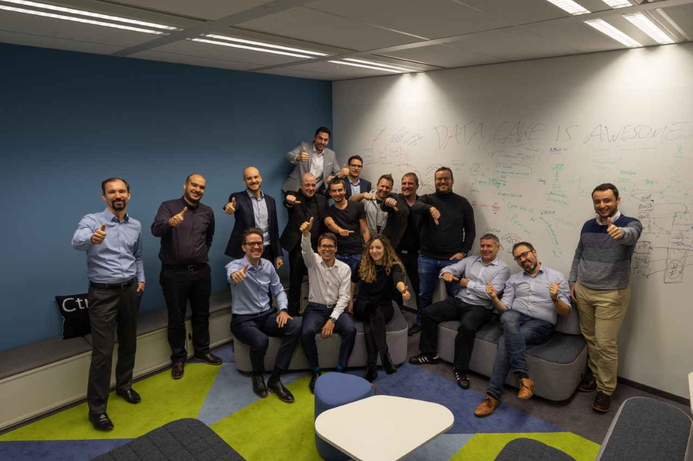
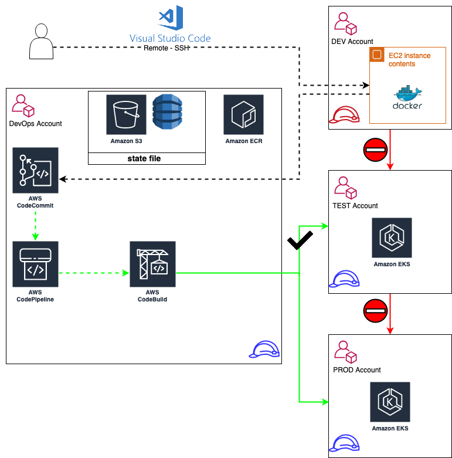

# AWS Meetup #15 - hosted by Nordcloud ( 3<sup>rd</sup> December 2019 )

## https://www.meetup.com/Amazon-Web-Services-AWS-Vienna/events/266041775/

## About me: http://mladen.trampic.info
Up to date - Data Lake Solution Arhitect @ Raiffeisen Bank International 

## What do my teammates do, together with me?
We are building up Analytical / Operational Data Lake for RBI. Fully in the cloud ( AWS ).
- Analytical DL - Support Data Scientists
- Operational DL - Well everything else ...



## How does Nordcloud fits?
<table>
 <tr>
    <td></td>
    <td>Well, We have an Elf from Nordcloud clouds,<br> you can find him on linkedin @ https://www.linkedin.com/in/marczis/ <br> When he is not running linux that is behind the Clouds...</td>
 </tr>
</table>

## One line marketing - open Positions @ RBI
- https://jobs.rbinternational.com/Data-Lake-Engineer-fmd-eng-j3386.html?sid=994cbf85f8ffeea9ed5362449c075a52
( if you are interested to apply, drop me a mail @ mladen.trampic@rbinternational.com - so I can't interview you and i get day off )


# What is cloudformation / terraform about?
It is all about infrastructure as a code, immutable as much as in order to have continuity and stabilty in releases / infrastructure changes. Allowing you to rollback, test, automate deployment. ( sleep at nights )

## Cloudformation
You can write templates in following forms:
- json
- yaml

AWS Native tool, With ease you can create create almost any AWS resource.

## YAML example
```yaml
AWSTemplateFormatVersion: "2010-09-09"
Parameters: 
  DevOpsAccountId: 
    Type: String
    Default: 'placeholder for valid account id'
Resources:
  TerraformDeployRole:
    Type: "AWS::IAM::Role"
    Properties:
      RoleName: 'aws-meetup-tf-apply'
      Policies:
      - PolicyName: "TerraformDeployRole"
        PolicyDocument:
          Version: '2012-10-17'
          Statement:
          - Effect: "Allow"
            Action: '*'
            Resource: '*'
      AssumeRolePolicyDocument:
        Version: "2012-10-17"
        Statement:
          - Effect: "Allow"
            Principal:
              AWS:
                - !Ref DevOpsAccountId
            Action:
              - "sts:AssumeRole"
```

If you are repetetive, you can always put jinja in front and make some magic... eg...
```yaml

```
```
project
│   README.md
│   file001.txt    
│
└───folder1
│   │   file011.txt
│   │   file012.txt
│   │
│   └───subfolder1
│       │   file111.txt
│       │   file112.txt
│       │   ...
│   
└───folder2
    │   file021.txt
    │   file022.txt 
```

## Terraform
Terraform Hashi Conf. Language ( HCL)

- https://github.com/hashicorp/hcl/blob/hcl2/hclsyntax/spec.md
- https://aws.amazon.com/blogs/apn/terraform-beyond-the-basics-with-aws/
- https://learn.hashicorp.com/terraform/getting-started/install.html


# How do We @ RBI do Terraform & DevOps?

